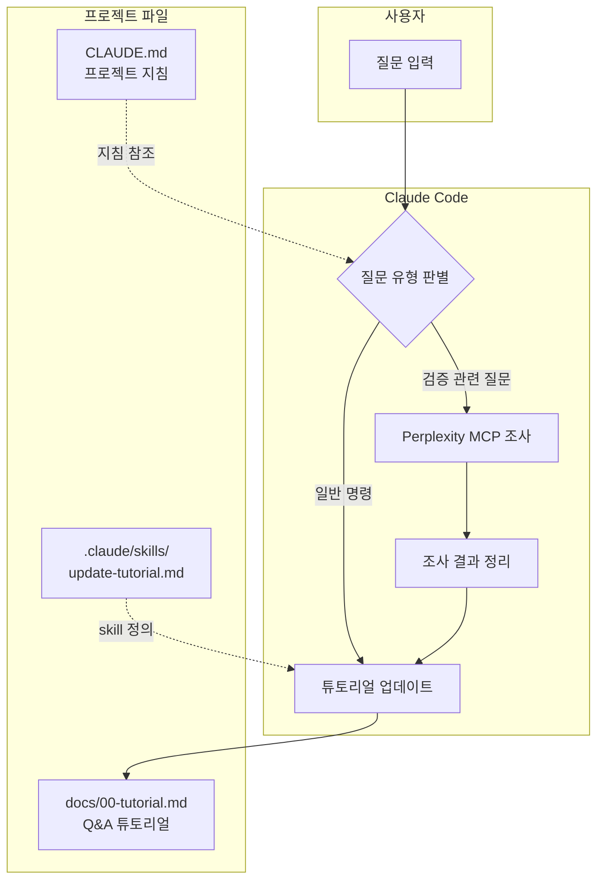

# 국가 AI 파운데이션 모델 "From Scratch" 검증 프로젝트

> **리포지토리 이름 변경 안내**: 이 프로젝트는 `solar-open-100b-scratch-verification`에서 `korea-ai-foundation-model-verification`으로 이름이 변경되었습니다. 이전 URL로 접속하면 자동으로 이 페이지로 리다이렉트됩니다.

## 프로젝트 개요

### 시작 동기

2026년 1월, 한국 AI 업계에서 "from scratch 학습" 논란이 발생했습니다. 이 논란을 계기로 **LLM에 문외한인 소프트웨어 개발자가 학습과 병행하여 어디까지 모델 검증이라는 전문 영역의 작업을 수행할 수 있는지** 검증해보고자 이 프로젝트를 시작했습니다.

### 저자 배경

- 30년차 소프트웨어 개발자
- 수학 전공 (낙제점이지만)
- LLM/ML 분야 비전문가

### 프로젝트 목표

1. **학습**: LLM 모델 검증 방법론 습득
2. **실습**: 실제 공개 모델에 검증 기법 적용
3. **문서화**: 학습 과정을 Q&A 튜토리얼로 기록

### 튜토리얼 안내

[Q&A 튜토리얼](docs/00-tutorial.md)에는 검증 과정에서 학습한 질문과 답변들이 정리되어 있습니다. LLM 검증 방법론에 관심 있는 분들께 참고가 되길 바랍니다.

---

## 검증 대상 모델

**국가 AI 파운데이션 모델 프로젝트**에 참여한 5개 기관의 공개 모델을 검증 대상으로 합니다.
어디까지나 비전문가가 LLM(클로드, 퍼플렉시티)에 의존하여 진행한 것이니 결과에 대해서는 책임을 지지 않습니다. 재미로 봐 주시고 전문가 분이 이슈에 의견 주시면 검증에 반영하도록 하겠습니다.

| 기관 | 모델명 | 파라미터 | 유형 | HuggingFace | 검증 상태 | 판정 |
|------|--------|----------|------|-------------|-----------|------|
| **Upstage** | Solar-Open-100B | 102B | MoE | [링크](https://huggingface.co/upstage/Solar-Open-100B) | ✅ 완료 | From scratch 신뢰 |
| **NAVER Cloud** | HyperCLOVAX-SEED-Think | 32B | Dense (VLM) | [링크](https://huggingface.co/naver-hyperclovax/HyperCLOVAX-SEED-Think-32B) | ⚠️ 진행중 | 부분적 재사용 |
| **SKT** | A.X-K1 | 519B | MoE | [링크](https://huggingface.co/skt/A.X-K1) | 📋 대기 | - |
| **NC AI** | VAETKI | 112B | MoE | [링크](https://huggingface.co/NC-AI-consortium-VAETKI/VAETKI) | 📋 대기 | - |
| **LG AI 연구원** | K-EXAONE | 236B | MoE | [링크](https://huggingface.co/LGAI-EXAONE/K-EXAONE-236B-A23B) | 📋 대기 | - |

---

## 종합 검증 결과

### 모델별 분석 요약

#### 1. Upstage Solar-Open-100B ✅

| 분석 방법 | 결과 | From scratch 지지 |
|----------|------|------------------|
| **Tokenizer** | vocab_size 196,608 (모든 모델과 불일치) | ✅ 강력 지지 |
| **Architecture** | 48 layers, 129 experts (고유 구성) | ✅ 강력 지지 |
| **Weight** | Architecture 불일치로 비교 불가 | ✅ 간접 지지 |
| **행동** | 공개 검증 세션에서 training logs 제시 | ⚠️ 조건부 지지 |

**판정: From scratch 신뢰 가능**

상세 분석:
- [Tokenizer 분석](docs/01-tokenizer-analysis.md)
- [Architecture 분석](docs/03-architecture-analysis.md)
- [Weight 분석](docs/02-weight-analysis.md)
- [행동 분석](docs/04-behavior-analysis.md)

---

#### 2. NAVER Cloud HyperCLOVAX-SEED-Think-32B ⚠️

| 컴포넌트 | 결과 | From scratch 여부 |
|----------|------|-------------------|
| **Vision Encoder** | Qwen2.5 ViT 사용 (config에 명시) | ❌ 재사용 |
| **Text Decoder** | 고유 architecture (rope_theta 50M) | ⚠️ 추가 검증 필요 |
| **Tokenizer** | vocab_size 128,256 = Llama 3 동일 | ⚠️ 의문점 |

**판정: 부분적 재사용 (Vision Encoder는 from scratch 아님)**

상세 분석: 각 분석 문서의 "모델별 검증 결과" 섹션 참조

---

#### 3. SKT A.X-K1 📋

| 항목 | 값 |
|------|-----|
| **모델 유형** | MoE |
| **총 파라미터** | 519B |
| **검증 상태** | 대기 중 |

---

#### 4. NC AI VAETKI 📋

| 항목 | 값 |
|------|-----|
| **모델 유형** | MoE |
| **총 파라미터** | 112B |
| **검증 상태** | 대기 중 |

---

#### 5. LG AI 연구원 K-EXAONE 📋

| 항목 | 값 |
|------|-----|
| **모델 유형** | MoE |
| **총 파라미터** | 236B |
| **검증 상태** | 대기 중 |

---

## 검증 방법론

LLM이 실제로 from scratch로 학습되었는지 확인하는 기술적 방법들:

| # | 방법 | 신뢰도 | 접근성 | 탐지력 | 상세 문서 |
|---|------|--------|--------|--------|----------|
| 1 | Tokenizer 분석 | 높음 | 높음 | 우수 | [상세 보기](docs/01-tokenizer-analysis.md) |
| 2 | Weight 분석 | 높음 | 중간 | 양호 | [상세 보기](docs/02-weight-analysis.md) |
| 3 | Architecture 분석 | 중간 | 높음 | 양호 | [상세 보기](docs/03-architecture-analysis.md) |
| 4 | 행동 분석 | 중간 | 높음 | 보통 | [상세 보기](docs/04-behavior-analysis.md) |
| 5 | Training Logs 검증 | 매우 높음 | 낮음 | 우수 | (접근 불가) |

### 방법론 요약

**1. [Tokenizer 분석](docs/01-tokenizer-analysis.md)**
- Vocabulary 비교, BPE merge rules 분석, 특수 토큰 패턴 비교

**2. [Weight 분석](docs/02-weight-analysis.md)**
- Layer별 cosine similarity, Weight tensor 해시 비교, PCA 분포 분석

**3. [Architecture 분석](docs/03-architecture-analysis.md)**
- config.json 비교, MoE 구조 분석, RoPE/Attention 설정 비교

**4. [행동 분석](docs/04-behavior-analysis.md)**
- Knowledge cutoff 테스트, Refusal pattern 분석, Safety alignment 특성

**5. Training Logs 검증** (접근 불가)
- Loss curve 패턴 분석, Compute 추정 (Chinchilla scaling 기준)

---

## 주요 발견 사항

### LayerNorm 유사도 의혹 검증 (Solar-Open-100B)

[hyunwoongko의 독립 검증](https://github.com/hyunwoongko/solar-vs-glm-vs-phi)에서 LayerNorm 96.8% 유사도 주장이 **방법론적 오류**였음이 밝혀졌습니다:

| 발견 | 설명 |
|------|------|
| **동일 모델 내 유사도** | 같은 모델의 다른 레이어 간에도 0.99 수준의 높은 cosine similarity |
| **초기화 특성** | LayerNorm weight가 1.0으로 초기화되어 방향적 일관성 유지 |
| **Centered cosine 분석** | 평균 오프셋 제거 시 **모델 간 유사도가 거의 0으로 하락** |
| **결론** | 원래 주장된 높은 유사도는 초기화 편향의 결과, 실제 파라미터 정렬 아님 |

### Vision Encoder 재사용 확인 (HyperCLOVAX)

HyperCLOVAX-SEED-Think-32B의 config.json에서 Vision Encoder가 **Qwen2.5 ViT**를 사용함이 명시적으로 확인되었습니다. VLM 모델의 경우 Vision 컴포넌트 재사용은 일반적인 관행이나, "from scratch" 주장 시 명확한 범위 정의가 필요합니다.

---

## 튜토리얼 자동 업데이트 시스템

이 프로젝트는 Claude Code의 hooks와 skills를 활용하여 Q&A 튜토리얼을 자동으로 업데이트합니다.

### 작동 방식



### 파일 구조

```
solar-open-100b-scratch-verification/
├── README.md                     # 메인 문서
├── CLAUDE.md                     # Claude 프로젝트 지침
├── docs/
│   ├── 00-tutorial.md            # Q&A 튜토리얼 (자동 업데이트)
│   ├── 01-tokenizer-analysis.md  # Tokenizer 분석 상세
│   ├── 02-weight-analysis.md     # Weight 분석 상세
│   ├── 03-architecture-analysis.md # Architecture 분석 상세
│   └── 04-behavior-analysis.md   # 행동 분석 상세
└── .claude/
    ├── settings.json             # Hooks 설정
    ├── commands/
    │   ├── commit-push.md        # /commit-push 커맨드
    │   └── save.md               # /save 커맨드 (빠른 저장)
    └── skills/
        └── update-tutorial.md    # /update-tutorial skill 정의
```

### 사용 가능한 Commands

| 커맨드 | 설명 | 사용법 |
|--------|------|--------|
| `/commit-push` | 변경사항 분석 후 커밋 & 푸시 | `/commit-push` |
| `/save` | 빠른 커밋 & 푸시 | `/save` 또는 `/save {메시지}` |
| `/update-tutorial` | Q&A 튜토리얼 수동 업데이트 | `/update-tutorial` |

---

## 참고 자료

### 검증 대상 모델
- [Hugging Face - Solar-Open-100B](https://huggingface.co/upstage/Solar-Open-100B)
- [Hugging Face - HyperCLOVAX-SEED-Think-32B](https://huggingface.co/naver-hyperclovax/HyperCLOVAX-SEED-Think-32B)
- [Hugging Face - A.X-K1](https://huggingface.co/skt/A.X-K1)
- [Hugging Face - VAETKI](https://huggingface.co/NC-AI-consortium-VAETKI/VAETKI)
- [Hugging Face - K-EXAONE](https://huggingface.co/LGAI-EXAONE/K-EXAONE-236B-A23B)

### 독립 검증 및 논문
- [LayerNorm 유사도 독립 검증 (hyunwoongko)](https://github.com/hyunwoongko/solar-vs-glm-vs-phi)
- [HyperCLOVA X Technical Report (arXiv)](https://arxiv.org/html/2404.01954v1)

### 검증 방법론
- [Model Integrity Verification](https://www.nightfall.ai/ai-security-101/model-integrity-verification)
- [LLM Evaluation Approaches](https://magazine.sebastianraschka.com/p/llm-evaluation-4-approaches)

---

## 라이선스

이 프로젝트의 문서와 코드는 MIT License로 공개됩니다.
