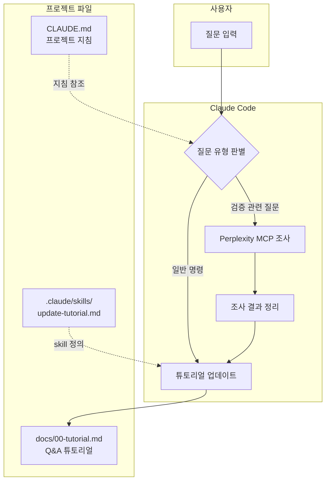
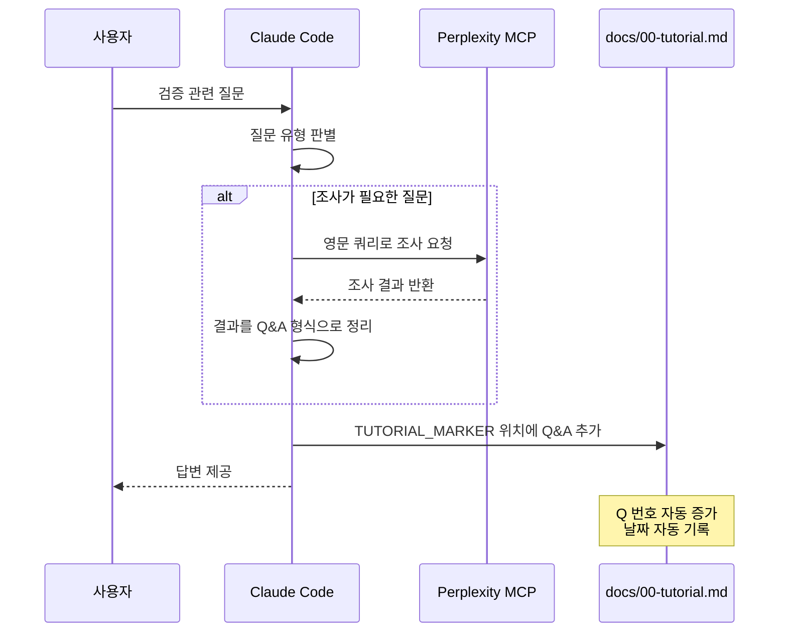

# Solar-Open-100B "From Scratch" 검증 프로젝트

## 튜토리얼 자동 업데이트 시스템

이 프로젝트는 Claude Code의 hooks와 skills를 활용하여 Q&A 튜토리얼을 자동으로 업데이트합니다.

### 작동 방식



### 프로세스 상세



### 튜토리얼 업데이트 규칙

| 조건 | 동작 |
|------|------|
| 사용자 입력이 **질문**인 경우 | Perplexity MCP로 조사 → Q&A 형식으로 튜토리얼에 추가 |
| 사용자 입력이 **명령**인 경우 | 명령 실행 (튜토리얼 업데이트 없음) |
| `/update-tutorial` 실행 | 현재 세션의 Q&A를 수동으로 튜토리얼에 추가 |

### 자동 업데이트 대상 질문 유형

다음 주제에 대한 질문은 자동으로 튜토리얼에 기록됩니다:

1. **LLM 학습 검증 방법론** - from scratch vs fine-tuning 판별
2. **Tokenizer 분석** - vocabulary, BPE merge, special tokens
3. **Weight 분석** - cosine similarity, 해싱, PCA
4. **Architecture 분석** - config 비교, 구조적 특징
5. **MoE 모델 지식** - Mixture-of-Experts 아키텍처
6. **Solar-Open-100B 구체적 분석** - 실제 검증 결과

### 파일 구조

```
solar-open-100b-scratch-verification/
├── README.md                     # 메인 문서
├── CLAUDE.md                     # Claude 프로젝트 지침
├── docs/
│   ├── 00-tutorial.md            # Q&A 튜토리얼 (자동 업데이트)
│   ├── 01-tokenizer-analysis.md  # Tokenizer 분석 상세
│   ├── 02-weight-analysis.md     # Weight 분석 상세
│   ├── 03-architecture-analysis.md # Architecture 분석 상세
│   └── 04-behavior-analysis.md   # 행동 분석 상세
└── .claude/
    ├── settings.json             # Hooks 설정
    ├── commands/
    │   ├── commit-push.md        # /commit-push 커맨드
    │   └── save.md               # /save 커맨드 (빠른 저장)
    └── skills/
        └── update-tutorial.md    # /update-tutorial skill 정의
```

### 사용 가능한 Commands

| 커맨드 | 설명 | 사용법 |
|--------|------|--------|
| `/commit-push` | 변경사항 분석 후 커밋 & 푸시 | `/commit-push` |
| `/save` | 빠른 커밋 & 푸시 | `/save` 또는 `/save {메시지}` |
| `/update-tutorial` | Q&A 튜토리얼 수동 업데이트 | `/update-tutorial` |

### Q&A 형식

새로운 Q&A는 다음 형식으로 `docs/00-tutorial.md`의 `<!-- TUTORIAL_MARKER -->` 위에 자동 추가됩니다:

```markdown
---

## Q{N}: {질문 제목}

**질문 시각**: {YYYY-MM-DD}

**답변**:

{Perplexity MCP 조사 기반 구조화된 답변}

---
```

---

## 프로젝트 개요

[upstage/Solar-Open-100B](https://huggingface.co/upstage/Solar-Open-100B) 모델이 실제로 "from scratch" (전체 가중치를 random initialization에서 시작하여 재학습)로 만들어졌는지 검증하는 프로젝트입니다.

이 프로젝트는 검증 과정에서 학습한 내용을 Q&A 튜토리얼 형태로 기록하여, LLM 모델의 학습 방식을 검증하는 방법론을 문서화합니다.

**튜토리얼 바로가기**: [Q&A 튜토리얼](docs/00-tutorial.md)

---

## Solar-Open-100B 공식 정보

| 항목 | 값 |
|------|-----|
| **모델 유형** | Mixture-of-Experts (MoE) |
| **총 파라미터** | 102.6B |
| **활성 파라미터** | 12B (토큰당) |
| **Expert 구성** | 129개 (128 routed + 1 shared, top-8 활성화) |
| **Context Length** | 128k tokens |
| **학습 토큰 수** | 19.7 trillion tokens |
| **학습 하드웨어** | NVIDIA B200 GPUs |
| **라이선스** | Solar-Apache License 2.0 |

**공식 주장**: "Trained Entirely from Scratch" (Hugging Face 모델 카드에 명시)

---

## 검증 방법론

LLM이 실제로 from scratch로 학습되었는지 확인하는 기술적 방법들:

| # | 방법 | 신뢰도 | 접근성 | 탐지력 | 상세 문서 |
|---|------|--------|--------|--------|----------|
| 1 | Tokenizer 분석 | 높음 | 높음 | 우수 | [상세 보기](docs/01-tokenizer-analysis.md) |
| 2 | Weight 분석 | 높음 | 중간 | 양호 | [상세 보기](docs/02-weight-analysis.md) |
| 3 | Architecture 분석 | 중간 | 높음 | 양호 | [상세 보기](docs/03-architecture-analysis.md) |
| 4 | 행동 분석 | 중간 | 높음 | 보통 | [상세 보기](docs/04-behavior-analysis.md) |
| 5 | Training Logs 검증 | 매우 높음 | 낮음 | 우수 | (접근 불가) |

### 방법론 요약

**1. [Tokenizer 분석](docs/01-tokenizer-analysis.md)**
- Vocabulary 비교, BPE merge rules 분석, 특수 토큰 패턴 비교

**2. [Weight 분석](docs/02-weight-analysis.md)**
- Layer별 cosine similarity, Weight tensor 해시 비교, PCA 분포 분석

**3. [Architecture 분석](docs/03-architecture-analysis.md)**
- config.json 비교, MoE 구조 분석, RoPE/Attention 설정 비교

**4. [행동 분석](docs/04-behavior-analysis.md)**
- Knowledge cutoff 테스트, Refusal pattern 분석, Safety alignment 특성

**5. Training Logs 검증** (접근 불가)
- Loss curve 패턴 분석, Compute 추정 (Chinchilla scaling 기준)

---

## 검증 진행 상황

- [ ] Tokenizer 분석
  - [ ] Solar-Open-100B tokenizer vocabulary 추출
  - [ ] Llama, Mistral, Qwen 등 주요 base model과 비교
  - [ ] 토큰 중복률 계산
- [ ] Architecture 분석
  - [ ] config.json 분석
  - [ ] 유사 MoE 모델들과 비교 (Mixtral, DeepSeek-MoE 등)
- [ ] Weight 분석 (선택적 - compute 리소스 필요)
  - [ ] Layer-wise similarity 분석
  - [ ] Embedding 비교
- [ ] 행동 분석
  - [ ] Knowledge cutoff 테스트
  - [ ] 특정 패턴 테스트

---

## 참고 자료

- [Hugging Face - Solar-Open-100B](https://huggingface.co/upstage/Solar-Open-100B)
- [Model Integrity Verification](https://www.nightfall.ai/ai-security-101/model-integrity-verification)
- [LLM Evaluation Approaches](https://magazine.sebastianraschka.com/p/llm-evaluation-4-approaches)

---

## 라이선스

이 프로젝트의 문서와 코드는 MIT License로 공개됩니다.
