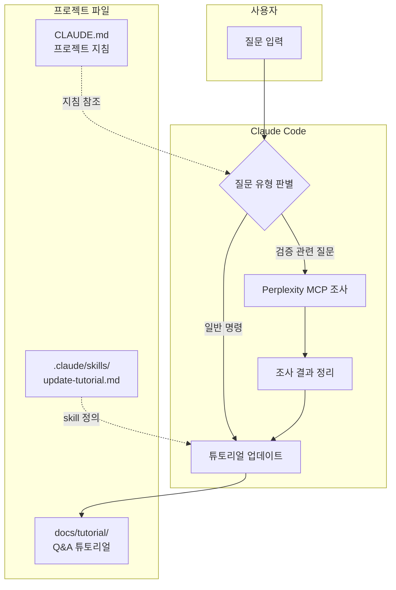

# 국가 AI 파운데이션 모델 "From Scratch" 검증 프로젝트

> ⚠️ **면책 조항**: 이 검증은 LLM 비전문가가 AI 도구(Claude, Perplexity)에 의존하여 진행한 것입니다. 분석 결과에 오류가 있을 수 있으며, 전문가의 추가 검증이 필요합니다. 이슈나 PR을 통한 피드백을 환영합니다.

> **리포지토리 이름 변경 안내**: 이 프로젝트는 `solar-open-100b-scratch-verification`에서 `korea-ai-foundation-model-verification`으로 이름이 변경되었습니다. 이전 URL로 접속하면 자동으로 이 페이지로 리다이렉트됩니다.

---

## 프로젝트 성격

**이 프로젝트는 불완전한 연구입니다.**

이 프로젝트의 핵심 목적은 모델 검증 그 자체가 아니라, **LLM 도구(Claude, Perplexity)를 활용하여 비전문가도 전문 영역의 학습과 실습이 가능하다는 것을 보여주는 POC(Proof of Concept)** 입니다.

| 이 프로젝트가 증명하고자 하는 것 | 이 프로젝트가 아닌 것 |
|-------------------------------|---------------------|
| LLM 도구를 활용한 자기주도 학습 가능성 | 공식적/권위적 검증 보고서 |
| 비전문가의 전문 영역 진입 장벽 완화 | 학술적으로 검증된 연구 |
| AI-assisted 학습 방법론 실험 | 모델 개발사에 대한 비판/평가 |

**[변경 이력 (Changelog)](CHANGELOG.md)** - 프로젝트의 진행 과정과 주요 변경 사항을 확인할 수 있습니다.

---

## 프로젝트 개요

### 시작 동기

2026년 1월, 한국 AI 업계에서 "from scratch 학습" 논란이 발생했습니다. 이 논란을 계기로 **LLM에 문외한인 소프트웨어 개발자가 학습과 병행하여 어디까지 모델 검증이라는 전문 영역의 작업을 수행할 수 있는지** 검증해보고자 이 프로젝트를 시작했습니다.

### 저자 배경

- 30년차 소프트웨어 개발자
- 수학 전공 (낙제점이지만)
- LLM/ML 분야 비전문가

### 프로젝트 목표

1. **학습**: LLM 모델 검증 방법론 습득
2. **실습**: 실제 공개 모델에 검증 기법 적용
3. **문서화**: 학습 과정을 [Q&A 튜토리얼](docs/tutorial/)로 기록

### 튜토리얼 안내

[Q&A 튜토리얼](docs/tutorial/)에는 검증 과정에서 학습한 질문과 답변들이 주제별로 정리되어 있습니다. AI를 활용한 학습과 LLM 검증 방법론에 관심 있는 분들께 참고가 되길 바랍니다.

---

## 검증 대상 모델

**국가 AI 파운데이션 모델 프로젝트**에 참여한 5개 기관의 공개 모델을 검증 대상으로 합니다.
어디까지나 비전문가가 LLM(클로드, 퍼플렉시티)에 의존하여 진행한 것이니 결과에 대해서는 책임을 지지 않습니다. 재미로 봐 주시고 전문가 분이 이슈에 의견 주시면 검증에 반영하도록 하겠습니다.

| 기관 | 모델명 | 파라미터 | 유형 | HuggingFace | 검증 상태 | 판정 |
|------|--------|----------|------|-------------|-----------|------|
| **Upstage** | Solar-Open-100B | 102B | MoE | [링크](https://huggingface.co/upstage/Solar-Open-100B) | ✅ 완료 | From scratch 신뢰 |
| **NAVER Cloud** | HyperCLOVAX-SEED-Think | 32B | Dense (VLM) | [링크](https://huggingface.co/naver-hyperclovax/HyperCLOVAX-SEED-Think-32B) | ⚠️ 진행중 | Vision 재사용 (투명 공개) |
| **SKT** | A.X-K1 | 519B | MoE | [링크](https://huggingface.co/skt/A.X-K1) | ✅ 완료 | From scratch 신뢰 |
| **NC AI** | VAETKI | 112B | MoE | [링크](https://huggingface.co/NC-AI-consortium-VAETKI/VAETKI) | ✅ 완료 | From scratch 신뢰 |
| **LG AI 연구원** | K-EXAONE | 236B | MoE | [링크](https://huggingface.co/LGAI-EXAONE/K-EXAONE-236B-A23B) | ✅ 완료 | From scratch 신뢰 |

---

## 종합 검증 결과

### 모델별 분석 요약

#### 1. Upstage Solar-Open-100B ✅

| 분석 방법 | 결과 | From scratch 지지 |
|----------|------|------------------|
| **Tokenizer** | vocab_size 196,608 (모든 모델과 불일치) | ✅ 강력 지지 |
| **Architecture** | 48 layers, 129 experts (고유 구성) | ✅ 강력 지지 |
| **Weight** | Architecture 불일치로 비교 불가 | ✅ 간접 지지 |
| **행동** | 공개 검증 세션에서 training logs 제시 | ⚠️ 조건부 지지* |

> *조건부 지지: Training logs는 공개 세션 참석자만 직접 확인 가능했으며, 외부에서 독립적으로 검증할 수 없음. 단, [YouTube Live](https://www.youtube.com/live/2YY9aAUSo_w)로 공개되어 투명성은 확보됨.

**판정: From scratch 신뢰 가능**

상세 분석:
- [Tokenizer 분석](docs/01-tokenizer-analysis.md)
- [Architecture 분석](docs/03-architecture-analysis.md)
- [Weight 분석](docs/02-weight-analysis.md)
- [행동 분석](docs/04-behavior-analysis.md)

---

#### 2. NAVER Cloud HyperCLOVAX-SEED-Think-32B ⚠️

| 컴포넌트 | 결과 | From scratch 여부 |
|----------|------|-------------------|
| **Vision Encoder** | Qwen2.5 ViT 파인튜닝 사용 (네이버 공식 인정) | ❌ 재사용* |
| **Audio Encoder** | Qwen2.5 그대로 사용 (네이버 공식 인정) | ❌ 재사용* |
| **Text Decoder** | "100% 자체 기술" 주장 (네이버 입장) | ⚠️ 추가 검증 필요** |
| **Tokenizer** | Llama 3 재사용 아님, Qwen 계열 유사성 발견 | ⚠️ 전문가 검증 필요*** |

> *Vision/Audio Encoder 재사용 (2026-01-05 네이버 공식 인정):
> - [뉴스1 단독 보도](https://www.news1.kr/it-science/general-it/6029076)에 따르면, 네이버클라우드는 Qwen 2.5 모델의 **Vision Encoder를 파인튜닝하여 사용**하고, **Audio Encoder는 원본 그대로 사용**한 사실을 인정
> - Vision Encoder: 코사인 유사도 99.51%, 피어슨 상관계수 98.98% 이상
> - 네이버 입장: "글로벌 최신 트렌드와의 호환성, 전체 시스템 최적화를 위해 전략적으로 채택"
> - [config.json](https://huggingface.co/naver-hyperclovax/HyperCLOVAX-SEED-Think-32B/blob/main/config.json)의 `vision_config.model_type: "qwen2_5_vl"`로 명시적 공개
> - **전문가 의견** (장두성 서강대 교수): "비전·이미지 인코더 재사용은 업계 관행이나, 일반적인 기준에서 이를 '프롬 스크래치'라고 하지는 않는다"
> - **정부 가이드라인 참고**: 국가 AI 파운데이션 모델 프로젝트는 "from scratch" 요건을 VLM의 모든 컴포넌트에 적용하는지 명시하지 않음 ([MSIT 발표](https://www.msit.go.kr/eng/bbs/view.do?sCode=eng&nttSeqNo=1131&bbsSeqNo=42) 참조)

> **Text Decoder 추가 검증 필요:
> - 네이버 입장: "파운데이션 모델의 핵심 '두뇌'는 100% 자체 기술로 개발"
> - `rope_theta: 50,000,000` (Llama 3의 500,000 대비 100배)은 고유 설계를 시사
> - 그러나 행동 분석(Knowledge Cutoff, Refusal Pattern)이 미수행 상태
> - 직접 실행 환경 없이 Text Decoder의 독자성을 완전히 검증하기 어려움

> ***Tokenizer 심층 분석 결과 (2026-01-05):
>
> HyperCLOVAX-SEED tokenizer에 대해 Llama-3, Qwen2.5-VL과의 상세 비교 분석을 수행했습니다. 실제 tokenizer.json 파일을 기준으로 토큰 중복률과 BPE merge rules 순서를 분석한 결과, 예상과 다른 패턴이 발견되었습니다.
>
> **분석 대상 vocab_size:**
> - HyperCLOVAX-SEED (tokenizer.json): 110,524
> - Llama-3: 128,256
> - Qwen2.5-VL: 151,665
>
> **Llama-3와의 비교:**
> HyperCLOVAX-SEED와 Llama-3 간 토큰 중복률은 92.58%로 높게 나타났으나, BPE merge rules의 순서 일치율은 0.01%에 불과했습니다. 이는 두 tokenizer가 유사한 토큰 집합을 공유하지만, BPE 학습 과정에서 완전히 다른 순서로 토큰을 병합했음을 의미합니다. 따라서 **Llama-3 tokenizer를 직접 재사용한 것은 아님**으로 판단됩니다.
>
> **Qwen2.5-VL과의 비교:**
> 반면 Qwen2.5-VL과의 비교에서는 토큰 중복률 91.23%와 함께 BPE merge rules 순서 일치율이 1.54%로 나타났습니다. 이는 Llama-3 대비 150배 높은 수치입니다. 특히 **처음 20개의 merge rules가 완전히 일치**하는 것으로 확인되어, Qwen 계열 tokenizer와 유사한 BPE 학습 기반을 공유했을 가능성이 있습니다.
>
> **해석의 한계:**
> 이 분석 결과만으로 HyperCLOVAX-SEED가 Qwen tokenizer를 기반으로 했다고 단정할 수는 없습니다. BPE 학습 시 동일한 코퍼스 구성이나 학습 설정을 사용하면 유사한 merge 순서가 나타날 수 있기 때문입니다. 또한 분석에 사용된 모델(HyperCLOVAX-SEED-Vision-Instruct-3B)이 Think-32B와 동일한 tokenizer를 사용하는지도 추가 확인이 필요합니다.
>
> **결론:** Llama-3 직접 재사용은 아니나, Qwen 계열과의 관계에 대해서는 **전문가의 추가 검증이 필요**합니다. 상세 분석 결과는 [이슈 #5](https://github.com/serithemage/korea-ai-foundation-model-verification/issues/5)에서 확인할 수 있습니다.
>
> **참고:** 네이버가 인정한 오픈소스 차용은 Vision/Audio Encoder에 한정되며, Tokenizer에 대해서는 공식 언급이 없습니다. 따라서 Tokenizer의 Qwen 계열 유사성에 대해서는 별도의 해명이 필요합니다.

**판정: Vision/Audio Encoder 재사용 (네이버 공식 인정), Text Decoder 및 Tokenizer는 전문가 추가 검증 필요**

> 참고: Vision/Audio Encoder 재사용이 정부 가이드라인 위반인지는 불명확함. 공개된 프로젝트 요건에서 VLM 컴포넌트별 "from scratch" 요건을 명시하지 않으며, 네이버는 이를 투명하게 공개하고 "전략적 채택"으로 설명함.

상세 분석:
- [Tokenizer 분석](docs/01-tokenizer-analysis.md)
- [Architecture 분석](docs/03-architecture-analysis.md)
- [행동 분석](docs/04-behavior-analysis.md)
- [이슈 #5: Tokenizer 추가 검증](https://github.com/serithemage/korea-ai-foundation-model-verification/issues/5)

---

#### 3. SKT A.X-K1 ✅

| 분석 방법 | 결과 | From scratch 지지 |
|----------|------|------------------|
| **Tokenizer** | vocab_size 163,840 (모든 모델과 불일치) | ✅ 강력 지지 |
| **Architecture** | 61 layers, 193 experts, MHA (고유 구성) | ✅ 강력 지지 |
| **Weight** | Architecture 불일치로 비교 불가 | ✅ 간접 지지 |
| **행동** | 미수행 | ⚠️ 추가 가능* |

> *행동 분석 미수행 사유:
> - 직접 실행 환경(API 또는 로컬 추론) 없이 행동 분석 불가
> - Knowledge Cutoff, Refusal Pattern 등 행동 기반 검증은 수행되지 않음
> - Architecture와 Tokenizer의 고유성이 충분히 강력하여 From scratch 판정에는 영향 없음

> 추가 검토 사항:
> - 193 experts는 검증 대상 모델 중 가장 많은 수로, 독자적 설계 의도가 명확함
> - 다만 training logs나 학습 과정에 대한 공개 검증은 확인되지 않음

**판정: From scratch 신뢰 가능**

상세 분석:
- [Tokenizer 분석](docs/01-tokenizer-analysis.md)
- [Architecture 분석](docs/03-architecture-analysis.md)

---

#### 4. NC AI VAETKI ✅

| 분석 방법 | 결과 | From scratch 지지 |
|----------|------|------------------|
| **Tokenizer** | vocab_size 137,216 (모든 모델과 불일치) | ✅ 강력 지지 |
| **Architecture** | 48 layers, 129 experts, Hybrid Attention (고유 구성) | ✅ 강력 지지 |
| **Weight** | Architecture 불일치로 비교 불가 | ✅ 간접 지지 |
| **행동** | 미수행 | ⚠️ 추가 가능* |

> *행동 분석 미수행 사유:
> - 직접 실행 환경(API 또는 로컬 추론) 없이 행동 분석 불가
> - Knowledge Cutoff, Refusal Pattern 등 행동 기반 검증은 수행되지 않음
> - Architecture와 Tokenizer의 고유성이 충분히 강력하여 From scratch 판정에는 영향 없음

> 추가 검토 사항:
> - Hybrid Attention (GQA + Sliding Window)은 독자적 구현으로 보임
> - 고유한 Special Tokens 스타일 (`<|START|>`, `<|END|>`, `<tool_start>`, `<tool_end>`)은 독립 개발 증거
> - 다만 training logs나 학습 과정에 대한 공개 검증은 확인되지 않음

**판정: From scratch 신뢰 가능**

상세 분석:
- [Tokenizer 분석](docs/01-tokenizer-analysis.md)
- [Architecture 분석](docs/03-architecture-analysis.md)

---

#### 5. LG AI 연구원 K-EXAONE ✅

| 분석 방법 | 결과 | From scratch 지지 |
|----------|------|------------------|
| **Tokenizer** | vocab_size 153,600 (모든 모델과 불일치) | ✅ 강력 지지 |
| **Architecture** | 48 layers, 129 experts, LLLG Attention, 256K context (고유 구성) | ✅ 강력 지지 |
| **Weight** | Architecture 불일치로 비교 불가 | ✅ 간접 지지 |
| **행동** | 미수행 | ⚠️ 추가 가능* |

> *행동 분석 미수행 사유:
> - 직접 실행 환경(API 또는 로컬 추론) 없이 행동 분석 불가
> - Knowledge Cutoff, Refusal Pattern 등 행동 기반 검증은 수행되지 않음
> - Architecture와 Tokenizer의 고유성이 충분히 강력하여 From scratch 판정에는 영향 없음

> 추가 검토 사항:
> - LLLG Attention (Local-Local-Local-Global 패턴)은 EXAONE 시리즈 고유 기술
> - vocab_size 153,600은 Qwen2-72B(152,064)와 1,536 차이로 유사하나, Special Tokens 스타일 (`[BOS]`, `<|endofturn|>`)이 완전히 다름
> - 256K context length는 검증 대상 모델 중 최장으로, 별도 engineering 필요
> - 다만 training logs나 학습 과정에 대한 공개 검증은 확인되지 않음

**판정: From scratch 신뢰 가능**

상세 분석:
- [Tokenizer 분석](docs/01-tokenizer-analysis.md)
- [Architecture 분석](docs/03-architecture-analysis.md)

---

## 검증 방법론

LLM이 실제로 from scratch로 학습되었는지 확인하는 기술적 방법들:

| # | 방법 | 신뢰도 | 접근성 | 탐지력 | 상세 문서 |
|---|------|--------|--------|--------|----------|
| 1 | Tokenizer 분석 | 높음 | 높음 | 우수 | [상세 보기](docs/01-tokenizer-analysis.md) |
| 2 | Weight 분석 | 높음 | 중간 | 양호 | [상세 보기](docs/02-weight-analysis.md) |
| 3 | Architecture 분석 | 중간 | 높음 | 양호 | [상세 보기](docs/03-architecture-analysis.md) |
| 4 | 행동 분석 | 중간 | 높음 | 보통 | [상세 보기](docs/04-behavior-analysis.md) |
| 5 | Training Logs 검증 | 매우 높음 | 낮음 | 우수 | (접근 불가) |

### 방법론 상세 설명

#### 1. [Tokenizer 분석](docs/01-tokenizer-analysis.md) - 가장 접근성 높은 방법

**왜 Tokenizer가 중요한가?**
- Fine-tuning 시 tokenizer를 재학습하는 경우가 거의 없음 (embedding 호환성, 비용, 성능 저하 위험)
- Tokenizer의 유사성은 모델 기원을 추적하는 강력한 지표

**분석 항목:**
- **Vocabulary 비교**: `vocab_size`가 정확히 일치하면 동일 tokenizer 사용 강력 의심
- **BPE Merge Rules**: merge 순서가 동일하면 같은 tokenizer 증거
- **Special Tokens**: `<s>`, `</s>`, `<pad>` 등 패턴 비교

**판정 기준:**

| 중복률 | 해석 |
|--------|------|
| **>98%** | Fine-tuning 가능성 높음 |
| **90-98%** | Continued pre-training 또는 vocabulary 확장 |
| **<90%** | From scratch 학습 강력 증거 |

---

#### 2. [Weight 분석](docs/02-weight-analysis.md) - 직접적인 증거

**Cosine Similarity란?**
- 두 벡터 간의 방향적 유사성 측정: `cos(θ) = (A · B) / (||A|| × ||B||)`
- 결과 범위: -1 ~ 1 (1에 가까울수록 유사)

**분석 항목:**
- **Layer별 Cosine Similarity**: Fine-tuned 모델은 초기 layer에서 >0.95 유사도
- **Weight Tensor 해싱**: SHA-256으로 fingerprint 비교
- **PCA 분포 분석**: Fine-tuned는 base model 근처에 clustering

**판정 기준:**

| 지표 | Fine-tuning | From Scratch |
|------|-------------|--------------|
| 평균 Layer Cosine Sim | >0.90 | <0.3 |
| Embedding Cosine Sim | >0.98 | <0.1 |

**한계:** Architecture가 다르면 직접 비교 불가 → 이 자체가 from scratch 증거

---

#### 3. [Architecture 분석](docs/03-architecture-analysis.md) - 구조적 독립성

**왜 Architecture가 중요한가?**
- Fine-tuned 모델은 base model과 **동일한 architecture**를 가져야 함
- Architecture가 다르면 weight 비교 자체가 불가능

**분석 항목:**
- `hidden_size`, `num_layers`, `num_attention_heads`, `num_kv_heads`
- MoE 구조: `n_routed_experts`, `n_shared_experts`, `num_experts_per_tok`
- RoPE 설정: `rope_theta`, `rope_scaling`
- Attention 방식: GQA, MHA, Sliding Window 등

**판정 기준:**
- 핵심 5개 항목 중 0개 완전 일치 → 독립적 설계 (From scratch 지지)
- 특정 모델과 완전한 config 일치 → Fine-tuning 의심

---

#### 4. [행동 분석](docs/04-behavior-analysis.md) - 간접적 증거

**분석 항목:**
- **Knowledge Cutoff**: base model과 동일한 cutoff는 fine-tuning 의심
- **Refusal Pattern**: 특정 모델 특유의 거부 문구 패턴
- **출력 스타일**: 응답 구조 및 형식의 유사성

**한계:**
- Post-training으로 행동 수정 가능
- RLHF/DPO로 base 특성 변경 가능
- 직접 실행 환경 없이 분석 어려움

---

#### 5. Training Logs 검증 (접근 불가) - 가장 확실한 증거

**가장 신뢰할 수 있는 방법이지만 일반적으로 비공개:**
- Loss curve 패턴 분석
- Compute 추정 (Chinchilla scaling 기준)
- Random initialization 증거
- 중간 checkpoint 확인

> Solar-Open-100B는 [공개 검증 세션](https://www.youtube.com/live/2YY9aAUSo_w)에서 training logs를 제시한 유일한 모델

---

### 방법론의 한계와 학술 연구 결과

이 프로젝트의 검증 방법론에 대한 비판과 학술 연구 기반 재평가입니다.

#### 학술적으로 가장 신뢰할 수 있는 방법

**[Model Provenance Testing for Large Language Models](https://arxiv.org/html/2502.00706v1)** (arXiv:2502.00706v1)에 따르면:

| 방법 | 정확도 | 비고 |
|------|--------|------|
| **Black-box Output Similarity** | 90-95% precision | 동일 프롬프트 출력 토큰 일치율 통계 분석 |
| Config 비교 | 불충분 | Fine-tuning은 architecture 보존 |
| Weight 비교 | 유효 | White-box 접근 필요 |

#### 현재 방법론의 한계

| 방법 | 한계점 |
|------|--------|
| **config.json 비교** | Fine-tuning은 architecture를 보존하므로, 동일 dimension 모델이 파생작일 수 있음 |
| **vocab_size 비교** | Fine-tuning 시 tokenizer 그대로 사용하므로, vocab_size 일치가 파생 증거가 될 수 있음 |

#### 현재 프로젝트 판정의 유효성

**로직**: "vocab_size가 **불일치**하면 from scratch 지지"

| 상황 | 해석 | 유효성 |
|------|------|--------|
| vocab_size **다름** | Tokenizer 재학습 필요 → from scratch 강력 증거 | ✅ 유효 |
| vocab_size **같음** | 추가 검증 필요 (토큰 중복률, merge rules) | ⚠️ 추가 분석 필요 |

**결론**:
- **Solar, A.X-K1, VAETKI, K-EXAONE**: vocab_size 명확히 다름 → **판정 유효**
- **HyperCLOVAX**: vocab_size 유사 → **실제 토큰 중복률 분석 권장**

#### 관련 사례: Yi-Llama 논란

01.AI Yi-34B 모델 파생 의혹에 대한 [EleutherAI 분석](https://blog.eleuther.ai/nyt-yi-34b-response/): Architecture 동일성만으로는 파생 증거 불충분, Yi는 독립 학습으로 결론.

> 상세 분석: [튜토리얼 - 방법론 평가](docs/tutorial/05-방법론-평가.md) 참조

---

## 주요 발견 사항

### LayerNorm 유사도 의혹 검증 (Solar-Open-100B)

[hyunwoongko의 독립 검증](https://github.com/hyunwoongko/solar-vs-glm-vs-phi)에서 LayerNorm 96.8% 유사도 주장이 **방법론적 오류**였음이 밝혀졌습니다:

| 발견 | 설명 |
|------|------|
| **동일 모델 내 유사도** | 같은 모델의 다른 레이어 간에도 0.99 수준의 높은 cosine similarity |
| **초기화 특성** | LayerNorm weight가 1.0으로 초기화되어 방향적 일관성 유지 |
| **Centered cosine 분석** | 평균 오프셋 제거 시 **모델 간 유사도가 거의 0으로 하락** |
| **결론** | 원래 주장된 높은 유사도는 초기화 편향의 결과, 실제 파라미터 정렬 아님 |

### Vision Encoder 재사용 확인 (HyperCLOVAX)

HyperCLOVAX-SEED-Think-32B의 config.json에서 Vision Encoder가 **Qwen2.5 ViT**를 사용함이 명시적으로 확인되었습니다. VLM 모델의 경우 Vision 컴포넌트 재사용은 일반적인 관행이나, "from scratch" 주장 시 명확한 범위 정의가 필요합니다.

---

## 튜토리얼 자동 업데이트 시스템

이 프로젝트는 Claude Code의 hooks와 skills를 활용하여 Q&A 튜토리얼을 자동으로 업데이트합니다.

### 작동 방식



### 파일 구조

```
solar-open-100b-scratch-verification/
├── README.md                     # 메인 문서
├── CLAUDE.md                     # Claude 프로젝트 지침
├── docs/
│   ├── tutorial/                 # Q&A 튜토리얼 (주제별 분류)
│   │   ├── README.md             # 튜토리얼 인덱스
│   │   ├── 01-기초개념.md        # 기초 개념 Q&A
│   │   ├── 02-tokenizer-분석.md  # Tokenizer 분석 Q&A
│   │   ├── 03-weight-architecture-분석.md # Weight/Architecture Q&A
│   │   ├── 04-사례연구.md        # 모델 검증 사례 Q&A
│   │   └── 05-방법론-평가.md     # 방법론 평가 Q&A
│   ├── 01-tokenizer-analysis.md  # Tokenizer 분석 상세
│   ├── 02-weight-analysis.md     # Weight 분석 상세
│   ├── 03-architecture-analysis.md # Architecture 분석 상세
│   └── 04-behavior-analysis.md   # 행동 분석 상세
└── .claude/
    ├── settings.json             # Hooks 설정
    ├── commands/
    │   └── save.md               # /save 커맨드
    └── skills/
        └── update-tutorial.md    # /update-tutorial skill 정의
```

### 사용 가능한 Commands

| 커맨드 | 설명 | 사용법 |
|--------|------|--------|
| `/save` | 변경사항 분석 후 커밋 & 푸시 | `/save` 또는 `/save {메시지}` |
| `/update-tutorial` | Q&A 튜토리얼 수동 업데이트 | `/update-tutorial` |

---

## 참고 자료

### 검증 대상 모델
- [Hugging Face - Solar-Open-100B](https://huggingface.co/upstage/Solar-Open-100B)
- [Hugging Face - HyperCLOVAX-SEED-Think-32B](https://huggingface.co/naver-hyperclovax/HyperCLOVAX-SEED-Think-32B)
- [Hugging Face - A.X-K1](https://huggingface.co/skt/A.X-K1)
- [Hugging Face - VAETKI](https://huggingface.co/NC-AI-consortium-VAETKI/VAETKI)
- [Hugging Face - K-EXAONE](https://huggingface.co/LGAI-EXAONE/K-EXAONE-236B-A23B)

### 독립 검증 및 논문
- [LayerNorm 유사도 독립 검증 (hyunwoongko)](https://github.com/hyunwoongko/solar-vs-glm-vs-phi)
- [HyperCLOVA X Technical Report (arXiv)](https://arxiv.org/html/2404.01954v1)
- [Upstage Solar-Open-100B 훈련 로그 공개 (YouTube Live)](https://www.youtube.com/live/2YY9aAUSo_w)

### 검증 방법론
- [Model Integrity Verification](https://www.nightfall.ai/ai-security-101/model-integrity-verification)
- [LLM Evaluation Approaches](https://magazine.sebastianraschka.com/p/llm-evaluation-4-approaches)

---

## 라이선스

이 프로젝트의 문서와 코드는 MIT License로 공개됩니다.
